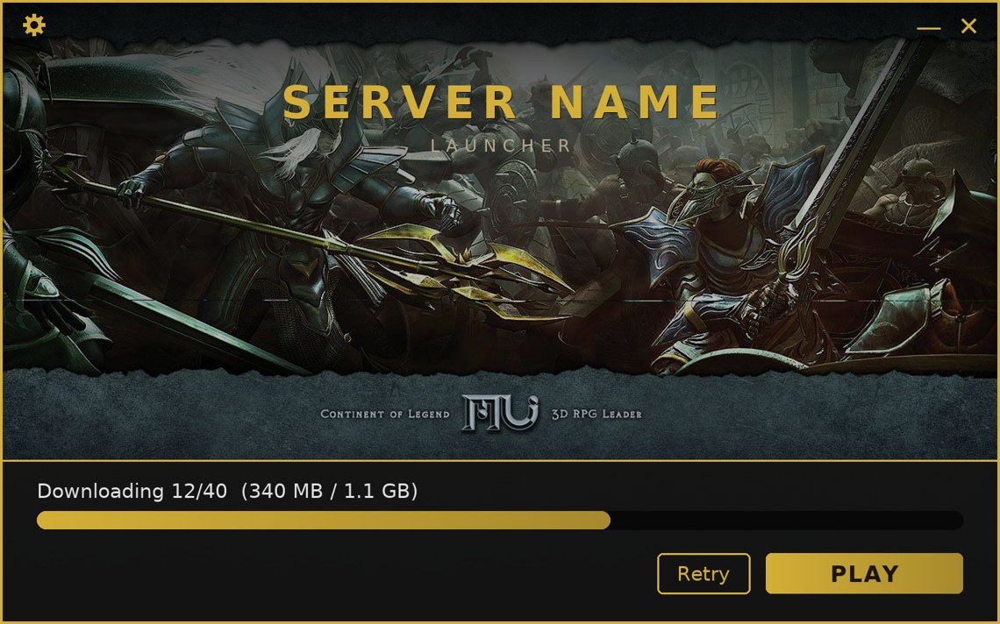

# MuMain Launcher

*[Wersja polska](Readme.pl.md)*

Cross-platform launcher and auto-updater for the [MuMain](https://github.com/sven-n/MuMain)
game client. It keeps a player's client files in sync with a patch server over
HTTP(S), then starts the client.



*Preview of the default theme. Everything you see — colours, background, name,
size — is configurable; see [Branding](docs/branding.md).*

## How updating works

1. The launcher downloads a **manifest** (`version.json`) from the patch server.
   The manifest lists every client file with its SHA-256 hash and size.
2. It compares each file against the local copy and downloads only what is new
   or changed, verifying the hash of every download.
3. It launches the client — directly on Windows, via Wine on Linux.

The launcher never deletes local files; it only adds and updates. Files such as
`config.ini`, logs and caches are therefore left untouched.

## Projects

| Project          | Role                                                                |
| ---------------- | ------------------------------------------------------------------- |
| `PatchManifest`  | Console tool: scans a release directory and writes `version.json`.  |
| `Launcher.Core`  | UI-free core: manifest parsing, diffing, downloading, verification. |
| `Launcher.App`   | Avalonia GUI: progress window and client launch.                    |

## Quickstart — from zero to a launcher

You only need **Docker** on the build machine (no local .NET SDK). For a Windows
host, use Docker Desktop and run `build.sh` from Git Bash/WSL.

```sh
# 1. Point the launcher at your patch host (one-time edit)
#    src/Launcher.Core/LauncherConfig.cs → ManifestUrl, LauncherManifestUrl

# 2. (optional) Brand it — colours, background, name, size
#    src/Launcher.App/Branding/Branding.axaml  +  src/Launcher.App/Assets/

# 3. Build the launcher binaries (file name defaults to MumainLauncher;
#    brand it per server with LAUNCHER_NAME, e.g. LAUNCHER_NAME=MyServer ./build.sh publish 2026.06.10)
./build.sh publish 2026.06.10

# 4. Take the binaries out of ./out/launcher/  (named after LAUNCHER_NAME)
#    MumainLauncher.exe → Windows players
#    MumainLauncher     → Linux players
#    launcher.json      → upload to the patch host for self-update

# 5. Generate the client manifest over your built client and upload everything
./build.sh manifest --input /path/to/client
```

Full walkthrough: **[Building & extracting](docs/building.md)**.

## Documentation

- **[Building & extracting](docs/building.md)** — Docker setup, every `build.sh`
  command, where the output lands and which file to ship, plus a local test recipe.
- **[Branding](docs/branding.md)** — change colours, background, fonts, window
  size and the frame — all from one file.
- **[Releasing updates](docs/releasing-updates.md)** — admin workflow: patch URLs,
  publishing a client update, publishing a new launcher, server directory layout.
- **[Manifest format](docs/manifest-format.md)** — reference for `version.json`
  and `launcher.json`.
- **[Player guide](docs/player-guide.md)** — how an end player installs and runs it.
- **[Troubleshooting](docs/troubleshooting.md)** — Wine, Linux and packaging gotchas.

## Roadmap

See [docs/ROADMAP.md](docs/ROADMAP.md) for status and optional future work.

## License

MIT — see [LICENSE](LICENSE). Use, modify and redistribute it freely; just keep
the copyright and licence notice in copies and forks.

Original author: [nolt](https://github.com/nolt).
