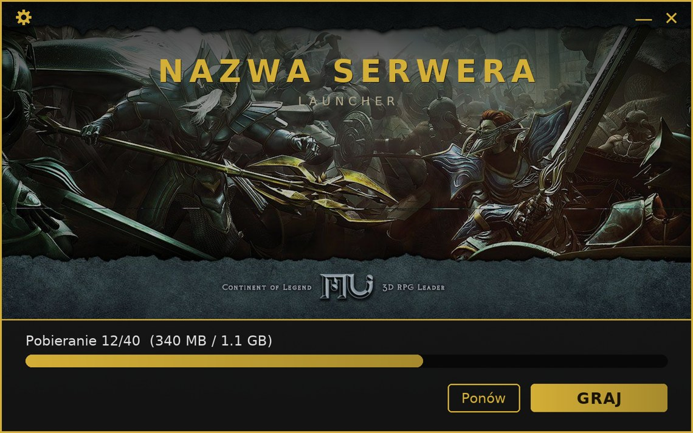

# MuMain Launcher

*[English version](README.md)*

Wieloplatformowy launcher i auto-updater dla klienta gry
[MuMain](https://github.com/sven-n/MuMain). Synchronizuje pliki klienta gracza
z serwerem patchy przez HTTP(S), a następnie uruchamia klienta.



*Podgląd domyślnego motywu. Wszystko, co widać — kolory, tło, nazwa, rozmiar —
jest konfigurowalne; zobacz [Wygląd / branding](docs/branding.pl.md).*

## Jak działa aktualizacja

1. Launcher pobiera **manifest** (`version.json`) z serwera patchy. Manifest
   zawiera listę wszystkich plików klienta z ich hashami SHA-256 i rozmiarami.
2. Porównuje każdy plik z lokalną kopią i pobiera tylko to, co nowe lub
   zmienione, weryfikując hash każdego pobrania.
3. Uruchamia klienta — bezpośrednio na Windows, przez Wine na Linuksie.

Launcher nigdy nie usuwa lokalnych plików; tylko dodaje i aktualizuje. Pliki
takie jak `config.ini`, logi i cache pozostają nietknięte.

## Projekty

| Projekt          | Rola                                                                       |
| ---------------- | -------------------------------------------------------------------------- |
| `PatchManifest`  | Narzędzie konsolowe: skanuje katalog wydania i zapisuje `version.json`.     |
| `Launcher.Core`  | Rdzeń bez UI: parsowanie manifestu, porównywanie, pobieranie, weryfikacja.  |
| `Launcher.App`   | GUI Avalonia: okno postępu i uruchamianie klienta.                         |

## Szybki start — od zera do launchera

Na maszynie budującej potrzebny jest tylko **Docker** (bez lokalnego .NET SDK).
Na Windows użyj Docker Desktop i uruchamiaj `build.sh` z Git Bash/WSL.

```sh
# 1. Wskaż launcherowi Twój serwer patchy (jednorazowa edycja)
#    src/Launcher.Core/LauncherConfig.cs → ManifestUrl, LauncherManifestUrl

# 2. (opcjonalnie) Zbranduj — kolory, tło, nazwa, rozmiar
#    src/Launcher.App/Branding/Branding.axaml  +  src/Launcher.App/Assets/

# 3. Zbuduj binarki launchera (nazwa pliku domyślnie MumainLauncher;
#    zbranduj per serwer przez LAUNCHER_NAME, np. LAUNCHER_NAME=MojSerwer ./build.sh publish 2026.06.10)
./build.sh publish 2026.06.10

# 4. Wyciągnij binarki z ./out/launcher/  (nazwane wg LAUNCHER_NAME)
#    MumainLauncher.exe → gracze Windows
#    MumainLauncher     → gracze Linux
#    launcher.json      → wgraj na serwer patchy (do samo-aktualizacji)

# 5. Wygeneruj manifest klienta nad zbudowanym klientem i wgraj całość
./build.sh manifest --input /sciezka/do/klienta
```

Pełny przewodnik: **[Budowanie i wyciąganie](docs/building.pl.md)**.

## Dokumentacja

- **[Budowanie i wyciąganie](docs/building.pl.md)** — konfiguracja Dockera, każda
  komenda `build.sh`, gdzie lądują pliki i co wysłać, oraz lokalny test.
- **[Wygląd / branding](docs/branding.pl.md)** — zmiana kolorów, tła, czcionek,
  rozmiaru okna i ramki — wszystko z jednego pliku.
- **[Wydawanie aktualizacji](docs/releasing-updates.pl.md)** — workflow admina:
  adresy patchy, wydanie aktualizacji klienta, wydanie nowego launchera, układ
  katalogów na serwerze.
- **[Format manifestu](docs/manifest-format.pl.md)** — referencja `version.json`
  i `launcher.json`.
- **[Przewodnik gracza](docs/player-guide.pl.md)** — jak gracz instaluje i uruchamia.
- **[Rozwiązywanie problemów](docs/troubleshooting.pl.md)** — pułapki Wine, Linux
  i pakowania.

## Roadmap

Status i opcjonalne dalsze prace: [docs/ROADMAP.md](docs/ROADMAP.md) *(w języku angielskim)*.

## Licencja

MIT — zobacz [LICENSE](LICENSE). Używaj, modyfikuj i rozpowszechniaj dowolnie;
zachowaj jedynie notkę o prawach autorskich i licencji w kopiach i forkach.

Autor oryginalny: [nolt](https://github.com/nolt).
